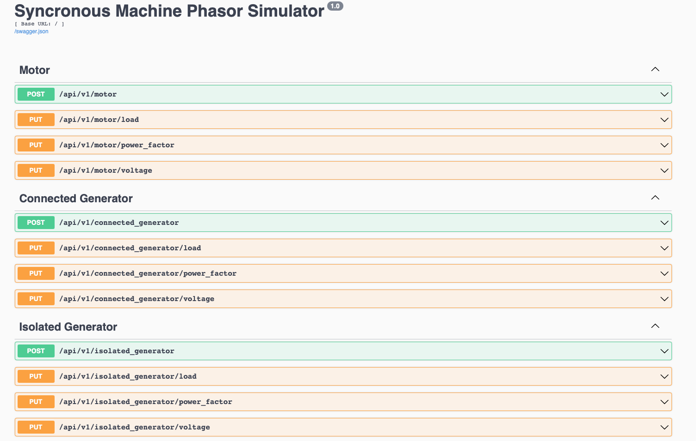

# This repository is an open source project to visualize electrical phasors in different situations

The project back end is a Python API written with Flask and the front-end is written in Javascript with React.

**The front functionalities is presented below:**


 
The frontend is hosted on Netlify, click the link to see more: https://maq-sincronas-uff.netlify.app

<br/>

The API is hosted on Heroku.

**BASE URL:** `https://maq-sinc-uff.herokuapp.com/api/v1`

The API has the following endpoints:

<br/>


Test the available endpoints at: https://maq-sinc-uff.herokuapp.com/api/v1/docs

### Test Output
```bash
pytest
Test session starts (platform: darwin, Python 3.9.5, pytest 6.2.5, pytest-sugar 0.9.4)
rootdir: /Users/guilhermealvespimenta/PycharmProjects/tcc
plugins: sugar-0.9.4, anyio-3.3.4
collecting ... 
                                                                                                                                                                                                                                         
tests/test_connected_generator.py ✓✓✓✓    33% ███▍

tests/test_isolated_generator.py ✓✓✓✓     67% ██████▋                                                                                                                                                                                                                                                                   

tests/test_motor.py ✓✓✓✓                 100% ██████████                                                                                                                                                                                                                                                         
 
Results (0.12s):
      12 passed

```
<br/>
<br/>


### Technologies used:
<br/>

**1. Flask**

* I chose to use Flask instead of Django due to the speed of development that the micro-framework would provide me when building the APIs.

* Used to build the endpoints.
 
<br/>
 

**2. Heroku**

* Great free cloud option for hosting back-end applications with CI/CD integrations.
     
* Used to host the API.

<br/>
      

**3. Netlify**
    
* Great free cloud option for hosting front-end applications with CI/CD integrations.

* Used to host the front-end.

 <br/>
 
**4. Python**

* Used to do the math calculations.
      
<br/>

**5. React**
      
* Used to build the front-end.

<br/>

**6. Swagger**

 * Great tool to facilitate the visualization of endpoints between different teams.

 * Used to build the API documentation.
      
<br/>
Thanks for reading!
